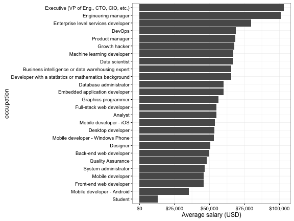
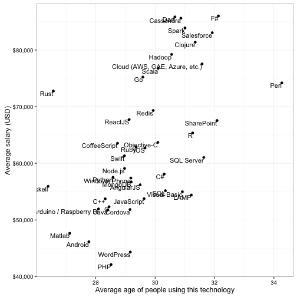

<!-- README.md is generated from README.Rmd. Please edit that file -->


## 2016 Stack Overflow Developer Survey Results

[](https://travis-ci.org/)

Results of the [Stack Overflow Developer Survey](http://stackoverflow.com/research/developer-survey-2016), wrapped in a convenient R package for analysis.

### Data

This package shares the survey results as two datasets. First is `stack_survey`:


```r
library(dplyr)
library(stacksurveyr)
stack_survey
#> Source: local data frame [56,030 x 66]
#> 
#>    respondent_id collector     country    un_subregion      so_region
#>            <int>     <chr>       <chr>           <chr>          <chr>
#> 1           1888  Facebook Afghanistan   Southern Asia   Central Asia
#> 2           4637  Facebook Afghanistan   Southern Asia   Central Asia
#> 3          11164  Facebook Afghanistan   Southern Asia   Central Asia
#> 4          21378  Facebook Afghanistan   Southern Asia   Central Asia
#> 5          30280  Facebook Afghanistan   Southern Asia   Central Asia
#> 6          31355  Facebook Afghanistan   Southern Asia   Central Asia
#> 7          31743  Facebook Afghanistan   Southern Asia   Central Asia
#> 8          51301  Facebook Afghanistan   Southern Asia   Central Asia
#> 9          13017  Facebook     Albania Southern Europe Eastern Europe
#> 10         24487  Facebook     Albania Southern Europe Eastern Europe
#> ..           ...       ...         ...             ...            ...
#> Variables not shown: age_range <fctr>, age_midpoint <dbl>, gender <chr>,
#>   self_identification <chr>, occupation <chr>, occupation_group <chr>,
#>   experience_range <fctr>, experience_midpoint <dbl>, salary_range <fctr>,
#>   salary_midpoint <dbl>, big_mac_index <dbl>, tech_do <chr>, tech_want
#>   <chr>, aliens <chr>, programming_ability <dbl>, employment_status <chr>,
#>   industry <chr>, company_size_range <fctr>, team_size_range <fctr>,
#>   women_on_team <chr>, remote <chr>, job_satisfaction <chr>, job_discovery
#>   <chr>, dev_environment <chr>, commit_frequency <chr>, hobby <chr>,
#>   dogs_vs_cats <chr>, desktop_os <chr>, unit_testing <chr>, rep_range
#>   <fctr>, visit_frequency <chr>, why_learn_new_tech <chr>, education
#>   <chr>, open_to_new_job <chr>, new_job_value <chr>, job_search_annoyance
#>   <chr>, interview_likelihood <chr>, how_to_improve_interview_process
#>   <chr>, star_wars_vs_star_trek <chr>, agree_tech <fctr>, agree_notice
#>   <fctr>, agree_problemsolving <fctr>, agree_diversity <fctr>,
#>   agree_adblocker <fctr>, agree_alcohol <fctr>, agree_loveboss <fctr>,
#>   agree_nightcode <fctr>, agree_legacy <fctr>, agree_mars <fctr>,
#>   important_variety <fctr>, important_control <fctr>, important_sameend
#>   <fctr>, important_newtech <fctr>, important_buildnew <fctr>,
#>   important_buildexisting <fctr>, important_promotion <fctr>,
#>   important_companymission <fctr>, important_wfh <fctr>,
#>   important_ownoffice <fctr>, developer_challenges <chr>,
#>   why_stack_overflow <chr>.
```

This contains one row for each survey respondent and one column for each question. It follows the format of the the released survey dataset at [stackoverflow.com/research](http://stackoverflow.com/research), with some [post-processing](data-raw) to turn questions with a natural order (such as "experience range") into ordered factors.

The package also contains a schema data frame describing each of the columns in `stack_survey`, including the original text of each question:


```r
stack_schema
#> Source: local data frame [66 x 4]
#> 
#>                 column     type
#>                  <chr>    <chr>
#> 1        respondent_id inferred
#> 2            collector inferred
#> 3              country   single
#> 4         un_subregion inferred
#> 5            so_region inferred
#> 6            age_range   single
#> 7         age_midpoint inferred
#> 8               gender   single
#> 9  self_identification    multi
#> 10          occupation   single
#> ..                 ...      ...
#> Variables not shown: question <chr>, description <chr>.
```

### Examples: Basic exploration

There's a lot of simple questions we can answer using this data, particularly using the dplyr package. For example, we can examine the most common occupations among respondents:


```r
stack_survey %>%
  count(occupation, sort = TRUE)
#> Source: local data frame [28 x 2]
#> 
#>                             occupation     n
#>                                  <chr> <int>
#> 1             Full-stack web developer 13886
#> 2                                   NA  6511
#> 3               Back-end web developer  6061
#> 4                              Student  5619
#> 5                    Desktop developer  3390
#> 6              Front-end web developer  2873
#> 7                                other  2585
#> 8  Enterprise level services developer  1471
#> 9           Mobile developer - Android  1462
#> 10                    Mobile developer  1373
#> ..                                 ...   ...
```

We can also use `group_by` and `summarize` to connect between columns- for example, finding the highest paid (on average) occupations:


```r
salary_by_occupation <- stack_survey %>%
  filter(!is.na(occupation), occupation != "other") %>%
  group_by(occupation) %>%
  summarize(average_salary = mean(salary_midpoint, na.rm = TRUE)) %>%
  arrange(desc(average_salary))

salary_by_occupation
#> Source: local data frame [26 x 2]
#> 
#>                                               occupation average_salary
#>                                                    <chr>          <dbl>
#> 1                 Executive (VP of Eng., CTO, CIO, etc.)      103073.93
#> 2                                    Engineering manager      101047.08
#> 3                    Enterprise level services developer       79855.62
#> 4                                                 DevOps       68731.96
#> 5                                        Product manager       68598.62
#> 6                                          Growth hacker       67878.79
#> 7                             Machine learning developer       67041.80
#> 8                                         Data scientist       66508.75
#> 9       Business intelligence or data warehousing expert       65660.92
#> 10 Developer with a statistics or mathematics background       65625.76
#> ..                                                   ...            ...
```

This can be visualized in a bar plot:


```r
library(ggplot2)
library(scales)

salary_by_occupation %>%
  mutate(occupation = reorder(occupation, average_salary)) %>%
  ggplot(aes(occupation, average_salary)) +
  geom_bar(stat = "identity") +
  ylab("Average salary (USD)") +
  scale_y_continuous(labels = dollar_format()) +
  coord_flip()
```



### Examples: Multi-response answers

10 of the questions allow multiple responses, as can be noted in the `stack_schema` variable:


```r
stack_schema %>%
  filter(type == "multi")
#> Source: local data frame [10 x 4]
#> 
#>                              column  type
#>                               <chr> <chr>
#> 1               self_identification multi
#> 2                           tech_do multi
#> 3                         tech_want multi
#> 4                   dev_environment multi
#> 5                         education multi
#> 6                     new_job_value multi
#> 7  how_to_improve_interview_process multi
#> 8            star_wars_vs_star_trek multi
#> 9              developer_challenges multi
#> 10               why_stack_overflow multi
#> Variables not shown: question <chr>, description <chr>.
```

In these cases, the responses are given delimited by `; `. For example, see the `tech_do` column (""Which of the following languages or technologies have you done extensive development with in the last year?"):  


```r
stack_survey %>%
  filter(!is.na(tech_do)) %>%
  select(tech_do)
#> Source: local data frame [49,025 x 1]
#> 
#>                                                                        tech_do
#>                                                                          <chr>
#> 1                                                             iOS; Objective-C
#> 2  Android; Arduino / Raspberry Pi; AngularJS; C; C++; C#; Cassandra; CoffeeSc
#> 3                                              JavaScript; PHP; SQL; WordPress
#> 4                                                                          PHP
#> 5             Arduino / Raspberry Pi; C; C++; Java; JavaScript; LAMP; PHP; SQL
#> 6                               Android; Cordova; MongoDB; PHP; SQL; WordPress
#> 7  C#; Dart; Java; JavaScript; LAMP; PHP; SQL; SQL Server; Visual Basic; WordP
#> 8                                 Java; JavaScript; LAMP; PHP; SQL; SQL Server
#> 9          Android; C++; C#; Cloud (AWS, GAE, Azure, etc.); Python; SQL Server
#> 10                                                                         SQL
#> ..                                                                         ...
```

Often, these columns are easier to work with and analyze when they are "unnested" into one user-answer pair per row. The package provides the `stack_multi` as a shortcut for that unnestting:


```r
stack_multi("tech_do")
#> Source: local data frame [225,075 x 3]
#> 
#>    respondent_id  column                 answer
#>            <int>   <chr>                  <chr>
#> 1           4637 tech_do                    iOS
#> 2           4637 tech_do            Objective-C
#> 3          31743 tech_do                Android
#> 4          31743 tech_do Arduino / Raspberry Pi
#> 5          31743 tech_do              AngularJS
#> 6          31743 tech_do                      C
#> 7          31743 tech_do                    C++
#> 8          31743 tech_do                     C#
#> 9          31743 tech_do              Cassandra
#> 10         31743 tech_do           CoffeeScript
#> ..           ...     ...                    ...
```

For example, we could find the most common answers with:


```r
stack_multi("tech_do") %>%
  count(tech = answer, sort = TRUE)
#> Source: local data frame [42 x 2]
#> 
#>          tech     n
#>         <chr> <int>
#> 1  JavaScript 27385
#> 2         SQL 21976
#> 3        Java 17942
#> 4          C# 15283
#> 5         PHP 12780
#> 6      Python 12282
#> 7         C++  9589
#> 8  SQL Server  9306
#> 9   AngularJS  8823
#> 10    Android  8601
#> ..        ...   ...
```

We can join this with the `stack_survey` dataset using the `respondent_id` column. For example, we could look at the most common development technologies used by data scientists:


```r
stack_survey %>%
  filter(occupation == "Data scientist") %>%
  inner_join(stack_multi("tech_do"), by = "respondent_id") %>%
  count(answer, sort = TRUE)
#> Source: local data frame [42 x 2]
#> 
#>        answer     n
#>         <chr> <int>
#> 1      Python   507
#> 2         SQL   356
#> 3           R   352
#> 4        Java   240
#> 5  JavaScript   207
#> 6         C++   155
#> 7           C   125
#> 8      Hadoop   108
#> 9  SQL Server    98
#> 10      Spark    97
#> ..        ...   ...
```

Or similarly, the most common developer environments:


```r
stack_survey %>%
  filter(occupation == "Data scientist") %>%
  inner_join(stack_multi("dev_environment"), by = "respondent_id") %>%
  count(answer, sort = TRUE)
#> Source: local data frame [23 x 2]
#> 
#>               answer     n
#>                <chr> <int>
#> 1                Vim   264
#> 2          Notepad++   231
#> 3            RStudio   226
#> 4  IPython / Jupyter   223
#> 5            Sublime   207
#> 6            Eclipse   148
#> 7            PyCharm   126
#> 8           IntelliJ   117
#> 9      Visual Studio   116
#> 10             Emacs    81
#> ..               ...   ...
```

We could find out the average age and salary of people using each technology, and compare them:


```r
stack_survey %>%
  inner_join(stack_multi("tech_do")) %>%
  group_by(answer) %>%
  summarize_each(funs(mean(., na.rm = TRUE)), age_midpoint, salary_midpoint) %>%
  ggplot(aes(age_midpoint, salary_midpoint)) +
  geom_point() +
  geom_text(aes(label = answer), vjust = 1, hjust = 1) +
  xlab("Average age of people using this technology") +
  ylab("Average salary (USD)") +
  scale_y_continuous(labels = dollar_format())
```



### License

This package, code, and examples is licensed under the GPL-3 license.

The survey data itself (which is contained in the [data-raw](data-raw) directory and available online [here](http://stackoverflow.com/research)), is made available by Stack Exchange, Inc under the [Open Database License (ODbL)](http://opendatacommons.org/licenses/odbl/1.0/). Any rights in individual contents of the database are licensed under the [Database Contents License (ODbL)](http://opendatacommons.org/licenses/odbl/1.0/)

Please note that this project is released with a [Contributor Code of Conduct](CONDUCT.md). By participating in this project you agree to abide by its terms.
